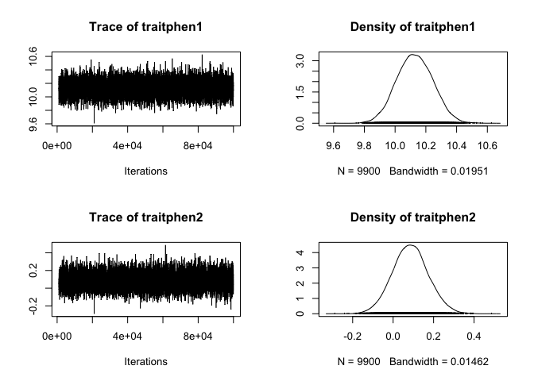
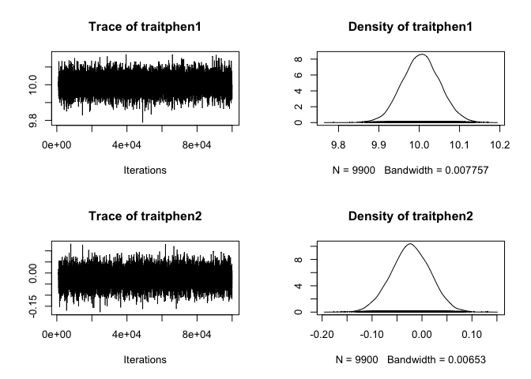

# animal-model-tutorial


* Goal here is to learn about the animal model, and figure out how you can run it without a pedigree.

* Use sample data from [Pierre de Villemereuil’s tutorial](http://devillemereuil.legtux.org/wp-content/uploads/2012/12/tuto_en.pdf) with and without a pedigree. Compare results.

* Figure out what the differences in the results mean!


```r
library(MCMCglmm)
```

Read in data


```r
pedigreemulti <- read.table('data-raw/pedigreemulti.txt',header=T)
datamulti <- read.table('data-raw/datamulti.txt',header=T)
models_run <- load("data-processed/modelmulti.RData") ## this has all the outputs from the models run in this script.
```

Glance at the data

```r
head(datamulti)
```

```
##   animal  phen1  phen2
## 1      1 11.006 -1.864
## 2      2 10.047 -0.770
## 3      3  9.299  0.835
## 4      4  9.870  0.769
## 5      5 10.466  2.916
## 6      6 10.131 -0.821
```


```r
head(pedigreemulti)
```

```
##   animal sire dam
## 1      1   NA  NA
## 2      2   NA  NA
## 3      3   NA  NA
## 4      4   NA  NA
## 5      5   NA  NA
## 6      6   NA  NA
```


```r
tail(pedigreemulti)
```

```
##      animal sire dam
## 995     995  801 853
## 996     996  788 843
## 997     997  792 829
## 998     998  780 804
## 999     999  814 833
## 1000   1000  805 853
```


Specify priors for the animal effect and the residual variance


```r
prior <- list(R=list(V=diag(2)/2,nu=2),
		 G=list(G1=list(V=diag(2)/2,nu=2)))
```

Set up and run model


```r
modelmulti <- MCMCglmm(cbind(phen1,phen2)~trait-1, ## the notation trait-1 allows us to estimate the mean of each trait, instead of the contrast between the two traits
					 random=~us(trait):animal, ##  define the structure of the variance-covariance matrix for the random effects 
					 rcov=~us(trait):units,  ##  define the structure of the variance-covariance matrix for the residual variances
					 family=c("gaussian","gaussian"), ## family requires a vector with the data distribution of each trait
					 prior=prior,
					 pedigree=pedigreemulti, ## specifies the pedigree; one row for each individual, each column specifies the parents for each individual
					 data=datamulti, ## includes two traits for each individual, i.e. phen1 and phen 2
					 nitt=100000,
					 burnin=1000,
					 thin=10)
```

Look at the outputs.


```r
summary(modelmulti)
```

```
## 
##  Iterations = 1001:99991
##  Thinning interval  = 10
##  Sample size  = 9900 
## 
##  DIC: 6038.181 
## 
##  G-structure:  ~us(trait):animal
## 
##                              post.mean l-95% CI u-95% CI eff.samp
## traitphen1:traitphen1.animal    1.1701   0.8796   1.4790     3814
## traitphen2:traitphen1.animal    0.6758   0.4761   0.8715     3733
## traitphen1:traitphen2.animal    0.6758   0.4761   0.8715     3733
## traitphen2:traitphen2.animal    0.5837   0.3950   0.7646     2567
## 
##  R-structure:  ~us(trait):units
## 
##                             post.mean l-95% CI u-95% CI eff.samp
## traitphen1:traitphen1.units    0.9342  0.76178   1.1132     4719
## traitphen2:traitphen1.units    0.1657  0.04761   0.2865     4028
## traitphen1:traitphen2.units    0.1657  0.04761   0.2865     4028
## traitphen2:traitphen2.units    0.9111  0.77959   1.0526     3972
## 
##  Location effects: cbind(phen1, phen2) ~ trait - 1 
## 
##            post.mean l-95% CI u-95% CI eff.samp  pMCMC    
## traitphen1  10.12897  9.89493 10.34527     9900 <1e-04 ***
## traitphen2   0.08575 -0.08264  0.26155     9900  0.326    
## ---
## Signif. codes:  0 '***' 0.001 '**' 0.01 '*' 0.05 '.' 0.1 ' ' 1
```

Plot it. 


```r
plot(modelmulti$Sol)
```

<!-- -->


Calculate heritabilities


```r
herit1<-modelmulti$VCV[,'traitphen1:traitphen1.animal']/ (modelmulti$VCV[,'traitphen1:traitphen1.animal']+ modelmulti$VCV[,'traitphen1:traitphen1.units'])
herit2<-modelmulti$VCV[,'traitphen2:traitphen2.animal']/(modelmulti$VCV[,'traitphen2:traitphen2.animal']+modelmulti$VCV[,'traitphen2:traitphen2.units'])
mean(herit1)
```

```
## [1] 0.5544819
```

```r
mean(herit2)
```

```
## [1] 0.3892478
```

Calculate genetic correlations among the two traits

```r
corr.gen<-modelmulti$VCV[,'traitphen1:traitphen2.animal']/
	sqrt(modelmulti$VCV[,'traitphen1:traitphen1.animal']*modelmulti$VCV[,'traitphen2:traitphen2.animal'])
	mean(corr.gen)
```

```
## [1] 0.8189895
```

Now run the same thing, but just don't give it a pedigree (i.e. remove that argument altogether)


```r
modelmulti_no_ped <- MCMCglmm(cbind(phen1,phen2)~trait-1, ## the notation trait-1 allows us to estimate the mean of each trait, instead of the contrast between the two traits
					   random=~us(trait):animal, ##  define the structure of the variance-covariance matrix for the random effects 
					   rcov=~us(trait):units,  ##  define the structure of the variance-covariance matrix for the residual variances
					   family=c("gaussian","gaussian"), ## family requires a vector with the data distribution of each trait
					   prior=prior,
					   # pedigree=pedigreemulti, ## specifies the pedigree; one row for each individual, each column specifies the parents for each individual
					   data=datamulti, ## includes two traits for each individual, i.e. phen1 and phen 2
					   nitt=100000,
					   burnin=1000,
					   thin=10)
```


Look at output

```r
summary(modelmulti_no_ped)
```

```
## 
##  Iterations = 1001:99991
##  Thinning interval  = 10
##  Sample size  = 9900 
## 
##  DIC: 5341.427 
## 
##  G-structure:  ~us(trait):animal
## 
##                              post.mean l-95% CI u-95% CI eff.samp
## traitphen1:traitphen1.animal    1.0196   0.1535   1.9159    88.42
## traitphen2:traitphen1.animal    0.3556  -0.2547   0.9838    84.51
## traitphen1:traitphen2.animal    0.3556  -0.2547   0.9838    84.51
## traitphen2:traitphen2.animal    0.7055   0.1686   1.2861   127.51
## 
##  R-structure:  ~us(trait):units
## 
##                             post.mean l-95% CI u-95% CI eff.samp
## traitphen1:traitphen1.units    1.1187   0.1966    1.964    86.08
## traitphen2:traitphen1.units    0.5022  -0.1354    1.112    88.44
## traitphen1:traitphen2.units    0.5022  -0.1354    1.112    88.44
## traitphen2:traitphen2.units    0.7764   0.1876    1.314   124.19
## 
##  Location effects: cbind(phen1, phen2) ~ trait - 1 
## 
##            post.mean l-95% CI u-95% CI eff.samp  pMCMC    
## traitphen1  10.00470  9.91761 10.09763     9900 <1e-04 ***
## traitphen2  -0.02263 -0.10141  0.05055     9900  0.566    
## ---
## Signif. codes:  0 '***' 0.001 '**' 0.01 '*' 0.05 '.' 0.1 ' ' 1
```

Plot it. 


```r
plot(modelmulti_no_ped$Sol)
```

<!-- -->


Calculate heritabilities


```r
herit1_no_ped<-modelmulti_no_ped$VCV[,'traitphen1:traitphen1.animal']/ (modelmulti_no_ped$VCV[,'traitphen1:traitphen1.animal']+ modelmulti_no_ped$VCV[,'traitphen1:traitphen1.units'])
herit2_no_ped<-modelmulti_no_ped$VCV[,'traitphen2:traitphen2.animal']/(modelmulti_no_ped$VCV[,'traitphen2:traitphen2.animal']+modelmulti_no_ped$VCV[,'traitphen2:traitphen2.units'])
mean(herit1_no_ped)
```

```
## [1] 0.4767207
```

```r
mean(herit2_no_ped)
```

```
## [1] 0.4761585
```

Calculate genetic correlations among the two traits. 


```r
corr.gen_no_ped<-modelmulti_no_ped$VCV[,'traitphen1:traitphen2.animal']/
	sqrt(modelmulti_no_ped$VCV[,'traitphen1:traitphen1.animal']*modelmulti_no_ped$VCV[,'traitphen2:traitphen2.animal'])
mean(corr.gen_no_ped)
```

```
## [1] 0.3272412
```

